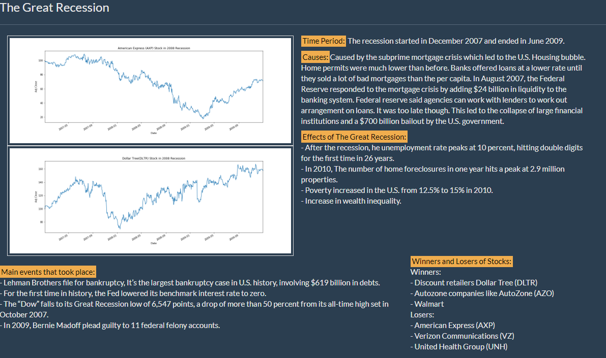
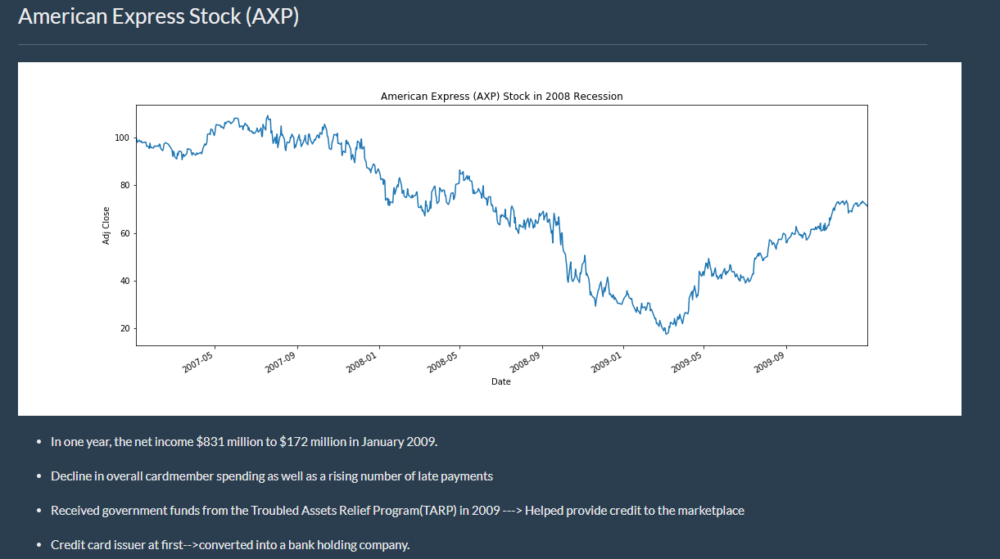
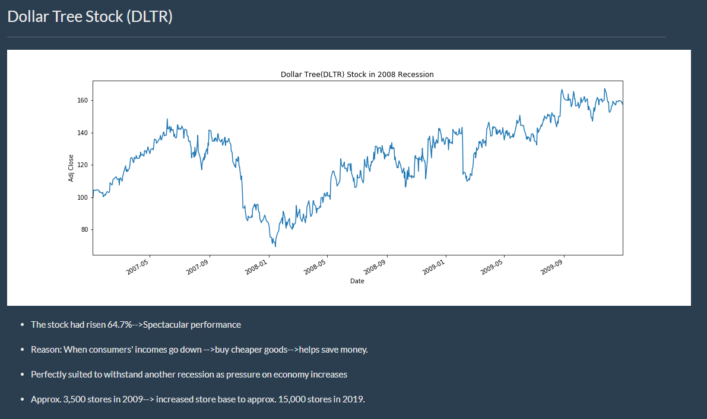

# The Great_Recession (December 2007 - June 2009)

An informative website was made showing the main events, consequences, and stocks that were impacted for each recession from last four years. I had taken the responsiblity to do an overview about the Great Recession. HTML and CSS was used to style the layout of the webpage. Pandas Data-Reader was used to extract the closing prices for the stocks from Yahoo Finance. I used the Matplotlib library to help show a visualization of a stock that was successful during this recession, which was the Dollar Tree Stock (DLTR). I also used the library to help show a visualization of a stock that performed poorly during this recession, which was the American Express Stock(Stock). 

### Poorly Performed Stock - American Express(AXP)

### Successful Stock - Dollar Tree(DLTR)

